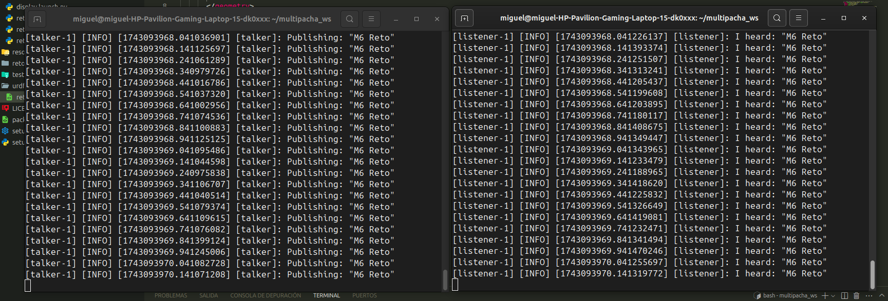
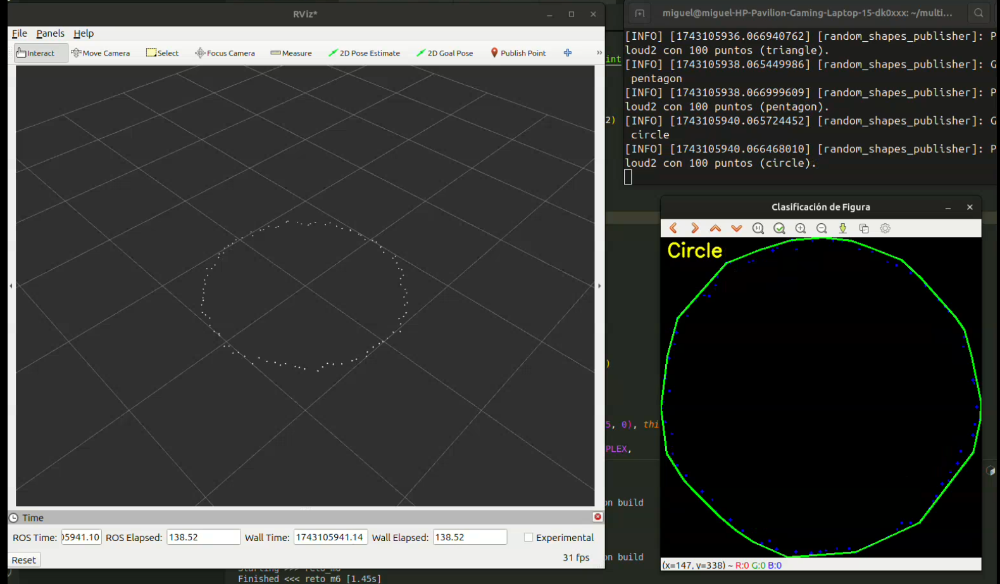
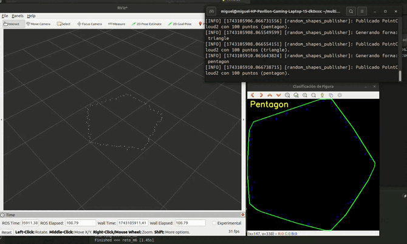
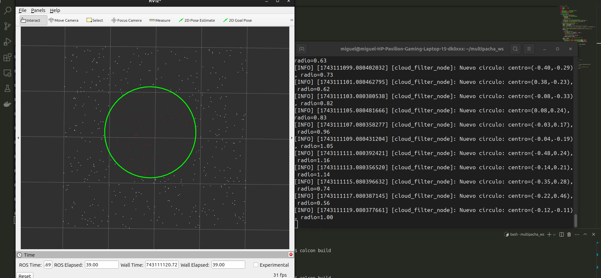
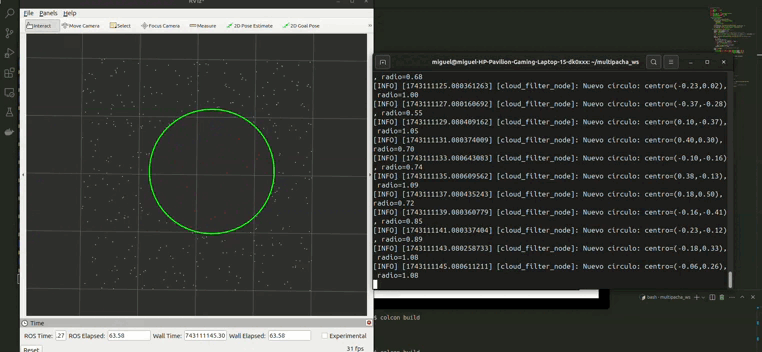
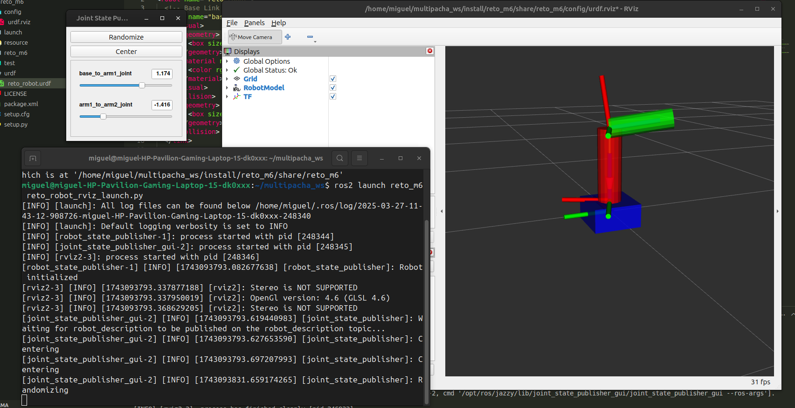

# Multipacha Reto M6 ROS Package

## 1. Instalación y Reproducción

### Requisitos Previos
- ROS2 Jazzy Jalisco instalado
- Dependencias de sistema operativo estándar para desarrollo de ROS2
- OpenCV
- RVIZ2

### Pasos de Instalación

1. Crear Workspace de ROS2
```bash
mkdir -p ~/multipacha_ws/src
cd ~/multipacha_ws/src
```

2. Clonar Repositorio
```bash
git clone https://github.com/MiguelCh2903/reto-m6.git
```

3. Instalar Dependencias
```bash
cd ~/multipacha_ws
rosdep install -i --from-path src --rosdistro jazzy -y
```

4. Compilar el Workspace
```bash
colcon build
```

5. Configurar Entorno
```bash
source install/local_setup.bash
```

### Ejecución Básica
```bash
# Ejecutar nodo publicador de tópicos
ros2 run reto_m6 talker

# Ejecutar nodo suscriptor de tópicos
ros2 run reto_m6 listener

# Ejecutar nodo de generación y publicación de pointcloud2
ros2 run reto_m6 pointcloud2

# Ejecutar nodos de clasificación de figuras
ros2 run reto_m6 figures_pub
ros2 run reto_m6 figures_sub

# Ejecutar nodos de filtrado dentro de área circular
ros2 run reto_m6 filter_pub
ros2 run reto_m6 filter_sub

# Lanzar nodos de tópicos
ros2 launch reto_m6 reto_topic_pub_launch.py
ros2 launch reto_m6 reto_topic_sub_launch.py

# Visualizar robot en RViz2
ros2 launch reto_m6 reto_robot_rviz_launch.py
```

## 2. Descripción Detallada del Paquete

### Visión General
Paquete ROS2 que implementa diversos nodos para procesamiento de nubes de puntos, publicación de tópicos y visualización de robot.

### Estructura del Paquete
- `reto_m6/`: Código fuente de los nodos
- `launch/`: Archivos de lanzamiento
- `config/`: Archivos de configuración
- `urdf/`: Archivos URDF (reto_robot.urdf)
- `setup.py`: Configuración de carpetas compartidas y definiciones de run scripts

### Nodos

#### reto_topic_pub.py y reto_topic_sub.py
- **Función**: Publicador y Suscriptor de tópicos
- **Frecuencia**: 10 Hz
- **Mensaje**: Mensajes fijos "Reto M6"
- **Referencia**: [Ejemplo de publicación de tópicos en ROS2 - Documentación](https://docs.ros.org/en/jazzy/Tutorials/Beginner-Client-Libraries/Writing-A-Simple-Py-Publisher-And-Subscriber.html)



#### reto_pointcloud2_pub.py
- **Función**: Publicador de nube de puntos
- **Descripción**: Genera una nube de puntos con 100 puntos

#### reto_figures_pub.py y reto_figures_sub.py
- **Función**: Clasificación de figuras geométricas
- **Descripción**: 
  - Genera una nube de puntos que forma una figura geométrica con ruido gaussiano
  - Recibe nube de puntos y clasifica la figura geométrica (círculo, triángulo, cuadrado, pentágono)
- **Herramienta**: Utiliza OpenCV para clasificación





#### reto_filter_pub.py y reto_filter_sub.py
- **Función**: Filtrado de nube de puntos
- **Descripción**: Separa puntos dentro de un área circular variable





### Visualización en RViz2


### Archivos de Lanzamiento
- `reto_topic_pub_launch.py` y `reto_topic_sub_launch.py`: Lanza nodos de publicación y suscripción de tópicos
- `reto_robot_rviz_launch.py`: Abre reto_robot.urdf en RViz2
